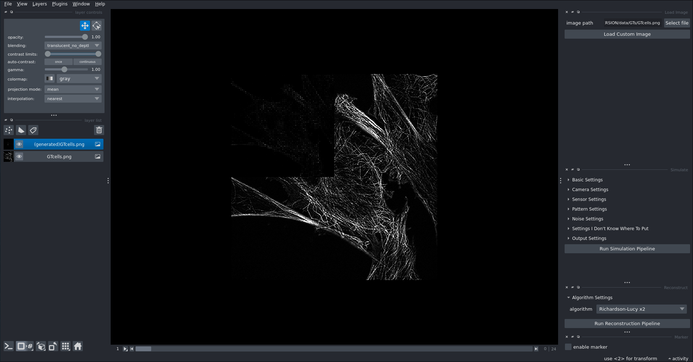

# XL_SIM-HPC
This is a copy of the original private XL_SIM project, removing all confidential parts to apply to the EuroHPC Development Call.

## HPC adaptation
We adapted the code for multi-gpu training of DL models, using Pytorch's Distributed Data Parallel (DDP).  
We are also exploring ways of increasing input image sizes during training by applying Fully Sharded Data Parallel (FSDP) and Tensor Parallelism.

# XL_SIM
XL_SIM is a project to create a Microscope that uses a novel Confocal Structural Image Microscopy (Confocal SIM) technique to ensure a high quality image without sacrificing the receptive field of the sample. To surpass the physical difraction limit of light, we employ Super-Resolution (SR) techniques that can reach 60nm/pixel resolution.  
The project is currently developing and training these algorithms for the future release of the microscope.

## Microscope Simulator
To obtain images from the microscope that is still under construction, we developed a simulator. An image can be fed to this simulator and the output consists of an image of 25 channels, each is a grid of points that cover the full image size.

## Viewer
A viewer prototype is currently being developed to visually compare the groundtruth image, the output of the simulated microscope and the output of the SR. It is built using the Napari library in python.

The upper left square is the output of the microscope simulator. As indicated by the bottom bar, it consists of 25 channels of displaced grid of points. The rest of the image corresponds to the original image (groundtruth).